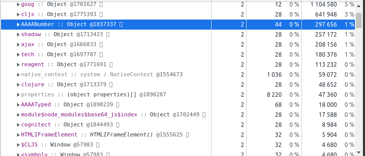

# DataFrame and Numerics for ClojureScript

[](https://clojars.org/com.cnuernber/tmdjs)

* [API Documentation](https://cnuernber.github.io/tmdjs/)
* For those of you dealing with a stream of maps - [mapseq-parser](https://cnuernber.github.io/tmdjs/tech.v3.dataset.html#var-mapseq-parser).
* Please see our topic on [Reductions](https://cnuernber.github.io/tmdjs/Reductions.html).

Minimal cljs implementation of [tech.v3.datatype](https://cnuernber.github.io/tmdjs/tech.v3.datatype.html),
[tech.v3.datatype.functional](https://cnuernber.github.io/tmdjs/tech.v3.datatype.functional.html),
[tech.v3.datatype.argops](https://cnuernber.github.io/tmdjs/tech.v3.datatype.argops.html), and
[tech.v3.dataset](https://cnuernber.github.io/tmdjs/tech.v3.dataset.html).  This implementation is based
on typed-arrays for numeric data and js arrays for everything else so it should
support all your favorite datatypes.  Support for columns of type `java.time.Instant` and
`java.time.LocalDate` is included.

Datasets serialize and deserialize much faster than sequences of maps.  They use less
memory and they allow faster columnwise operations.  To transform a sequence of maps
into a dataset use [ds/->dataset](https://cnuernber.github.io/tmdjs/tech.v3.dataset.html#var--.3Edataset).
To get a sequence of maps back use [ds/rows](https://cnuernber.github.io/tmdjs/tech.v3.dataset.html#var-rows).


This library is mainly going to useful if you are dealing with large amounts of primarily
numeric data such as timeseries data coming off of a sensor.  In that case you can specify
exactly the datatype of the column which will get you major benefits in terms of
memory and serialization size.  I developed this library when working with such data
in a react-native application.


Unlike the jvm-version this is a very minimal exposition of these concepts.  Since the
underlying vm itself is typeless there was no need for a complex macro system to do
unboxed math in loops so I could stay much closer to core clojure and in fact ICounted
and IIndexed are the primary interfaces and
[tech.v3.datatype/reify-reader](https://cnuernber.github.io/tmdjs/tech.v3.datatype.html#var-reify-reader)
creates a persistent-vector hash and equiv compatible object.


If you are totally new to all of this please check out my talk on [High Performance Data with Clojure](https://www.youtube.com/watch?v=5mUGu4RlwKE).
Many more talks are available from my [GitHub page](https://github.com/cnuernber).


## Example


#### Server Side

There is a new namespace, tech.v3.libs.transit that contains a transit-safe
dataset->data function.  There are also transit handlers defined if you know how to
override your transit handlers in your middleware.

```clojure
(defn generate-data
  [request]
  (-> (ds/->dataset (repeatedly 10000 #(hash-map :time (rand)
                                                 :temp (rand)
                                                 :temp1 (rand)
                                                 :temp2 (rand)
                                                 :valid? (if (> (rand) 0.5)
                                                           true
                                                           false))))
      (ds-t/dataset->data)
      (response/response)))
```

#### Client Side

The same namespace tech.v3.dataset is exposed for clojurescript containing most of the
usual functions - columns, rows, select-rows, group-by, etc.  The version of
dataset->data in this namespace corresponds with the version on the jvm side above.
There are also transit handlers defined if you have access to override the transit
handlers in your middleware stack.

```clojure
  (GET "/data" {:handler #(let [ds (ds/data->dataset %)]
                            (swap! app* assoc
                                   :ds ds
                                   :raw (mapv (partial into {}) (ds/rows ds))))})
```


#### Quick Walkthough

```clojure
;;Create a dataset from a map of columns
cljs.user> (def ds (ds/->dataset {:a (range 100)
                                  :b (take 100 (cycle [:a :b :c]))
                                  :c (take 100 (cycle ["one" "two" "three"]))}))

#'cljs.user/ds
cljs.user> ds
#dataset[unnamed [100 3]
| :a | :b |    :c |
|---:|----|-------|
|  0 | :a |   one |
|  1 | :b |   two |
|  2 | :c | three |
|  3 | :a |   one |
|  4 | :b |   two |
...

;; Control column datatypes by using parser-fn which is very thoroughly documented in
;; tech.ml.dataset api documentation

cljs.user> (->> (ds/->dataset {:a (range 100)
                               :b (take 100 (cycle [:a :b :c]))
                               :c (take 100 (cycle ["one" "two" "three"]))}
                              {:parser-fn {:a :int8}})
                (vals)
                (map (comp :datatype meta)))
(:int8 :keyword :string)


;; Datasets are always safe to print to your repl.  Only the first 25 rows are printed.
;; You can use datasets like maps of columns - columns also are safe to print to your
;; repl at all times.
cljs.user> (ds :a)
#column[[:float64 100][0 1 2 3 4 5 6 7 8 9 ... 90 91 92 93 94 95 96 97 98 99]

;;Add a new column with map.
cljs.user> (ds/head (assoc ds :aa (map #(* % %) (ds :a))))
#dataset[unnamed [5 4]
| :a | :b |    :c | :aa |
|---:|----|-------|----:|
|  0 | :a |   one |   0 |
|  1 | :b |   two |   1 |
|  2 | :c | three |   4 |
|  3 | :a |   one |   9 |
|  4 | :b |   two |  16 |]


;; Column map is bit more efficient
cljs.user> (ds/head (ds/column-map ds :aa #(* % %) [:a]))
#dataset[unnamed [5 4]
| :a | :b |    :c | :aa |
|---:|----|-------|----:|
|  0 | :a |   one |   0 |
|  1 | :b |   two |   1 |
|  2 | :c | three |   4 |
|  3 | :a |   one |   9 |
|  4 | :b |   two |  16 |]

;; Remove columns with dissoc
cljs.user> (ds/head (dissoc ds :c))
#dataset[unnamed [5 2]
| :a | :b |
|---:|----|
|  0 | :a |
|  1 | :b |
|  2 | :c |
|  3 | :a |
|  4 | :b |]

;;select particular rows
cljs.user> (ds/select-rows ds [1 3 5 7 9])
#dataset[unnamed [5 3]
| :a | :b |    :c |
|---:|----|-------|
|  1 | :b |   two |
|  3 | :a |   one |
|  5 | :c | three |
|  7 | :b |   two |
|  9 | :a |   one |]
```


* Once you have a dataset using the function in the dataset namespace to do columnwise
  operations will usually be a bit quicker.
* See [testapp](testapp) for a minimal quick walkthrough and verification that
advanced optimizations do not break the api.

## Chrome Heap Measurements.

For a 2-column dataset of just time and temperature of random double data dataset is about
18X smaller than a sequence of maps.  More columns or choosing different datatypes for the
columns will change the results in various ways but 10X isn't unreasonable.


```clojure

testapp.webapp> (def ignored
                  (->> (repeatedly 10000 #(hash-map :time (rand) :temp (rand)))
                       (ds/->>dataset)
                       ;;When building a dataset we save data using dynamically resizing
                       ;;backing stores.  Cloning crops the dataset to exactly the size
                       ;;it needs
                       (clone)
                       (aset js/window "AAAMemTest-Dataset")))
#'testapp.webapp/ignored
testapp.webapp> (def ignored (->> (repeatedly 10000 #(hash-map :time (rand) :temp (rand)))
                                  (vec)
                                  (aset js/window "AAAMemTest-Mapseq")))
#'testapp.webapp/ignored
```




## Gotchas


The js `:uint64` and `:int64` typed arrays produce BigNum objects.  When setting values
I transparently upcast to bignum but when getting values back you get bignums so
be careful.  I suggest avoiding using them unless you are sure of what you are
doing.  You can cast a bignum back to a number, with potential numeric loss,
with `(js/Number. bn)`.  This is unfortunate because the default clojure number
type on the jvm is a long and a dataset of longs has a column of type `:int64` and
thus if you naively send it over the wire you will have issues trying to work with
that dataset in your code.


## Development

This is what I have so far to make development quick

### Get a REPL

* clj -M:cljs node-repl
* cider-connect to port 8777 once it starts
* `(shadow/repl :node-repl)`

### Unit Tests

There is a test script - `scripts/run-tests` that does:

* clj -M:cljs compile test
* node target/test.js

### Install locally and try on different project

* scripts/install-local

## Talk About It

* [Zulip Data Science/tech.ml.dataset](https://clojurians.zulipchat.com/#narrow/stream/151924-data-science/topic/tech.2Eml.2Edataset)
* [Zulip tech.ml.dataset.dev](https://clojurians.zulipchat.com/#narrow/stream/236259-tech.2Eml.2Edataset.2Edev)

### License

* MIT
